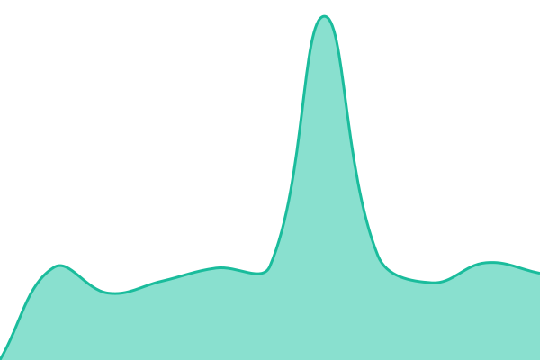
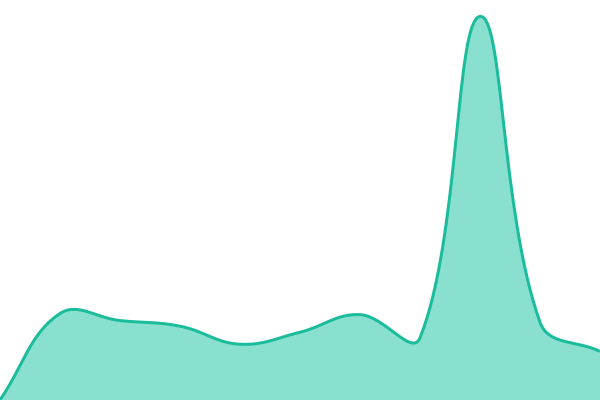
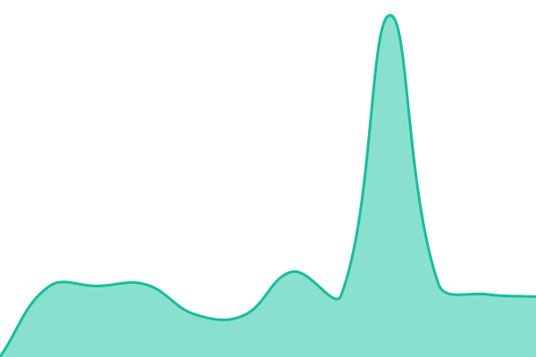
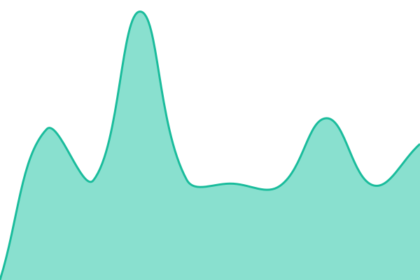

# [📈 Live Status](https://status.dieschoenewolke.de): <!--live status--> **🟧 Partial outage**

This repository contains the open-source uptime monitor and status page for [DieSchoeneWolke](dieschoenewolke.com), powered by [Upptime](https://github.com/upptime/upptime).

With [Upptime](https://upptime.js.org), you can get your own unlimited and free uptime monitor and status page, powered entirely by a GitHub repository. We use [Issues](https://github.com/DieSchoeneWolke/dieschoenewolke-upptime/issues) as incident reports, [Actions](https://github.com/DieSchoeneWolke/dieschoenewolke-upptime/actions) as uptime monitors, and [status.dieschoenewolke.de](https://status.dieschoenewolke.de) for the status page.

<!--start: status pages-->
<!-- This summary is generated by Upptime (https://github.com/upptime/upptime) -->
<!-- Do not edit this manually, your changes will be overwritten -->
<!-- prettier-ignore -->
| URL | Status | History | Response Time | Uptime |
| --- | ------ | ------- | ------------- | ------ |
|  [DieSchoeneWolke](https://dieschoenewolke.de) | 🟩 Up | [die-schoene-wolke.yml](https://github.com/DieSchoeneWolke/dieschoenewolke-upptime/commits/HEAD/history/die-schoene-wolke.yml) | 

 2071ms
     
 | 

<a href="https://status.dieschoenewolke.de/history/die-schoene-wolke">98.59%</a>
    

|  Arcane | 🟩 Up | [arcane.yml](https://github.com/DieSchoeneWolke/dieschoenewolke-upptime/commits/HEAD/history/arcane.yml) | 

 1025ms
     
 | 

<a href="https://status.dieschoenewolke.de/history/arcane">96.18%</a>
    

|  Forgejo | 🟥 Down | [forgejo.yml](https://github.com/DieSchoeneWolke/dieschoenewolke-upptime/commits/HEAD/history/forgejo.yml) | 

 927ms
     
 | 

<a href="https://status.dieschoenewolke.de/history/forgejo">32.53%</a>
    

|  Kanidm | 🟩 Up | [kanidm.yml](https://github.com/DieSchoeneWolke/dieschoenewolke-upptime/commits/HEAD/history/kanidm.yml) | 

 1682ms
     
 | 

<a href="https://status.dieschoenewolke.de/history/kanidm">96.20%</a>
    

|  Opencloud | 🟩 Up | [opencloud.yml](https://github.com/DieSchoeneWolke/dieschoenewolke-upptime/commits/HEAD/history/opencloud.yml) | 

 1281ms
     
 | 

<a href="https://status.dieschoenewolke.de/history/opencloud">95.39%</a>
    

|  Radicale | 🟩 Up | [radicale.yml](https://github.com/DieSchoeneWolke/dieschoenewolke-upptime/commits/HEAD/history/radicale.yml) | 

 1817ms
     
 | 

<a href="https://status.dieschoenewolke.de/history/radicale">96.21%</a>
    

|  Vaultwarden | 🟩 Up | [vaultwarden.yml](https://github.com/DieSchoeneWolke/dieschoenewolke-upptime/commits/HEAD/history/vaultwarden.yml) | 

 1044ms
     
 | 

<a href="https://status.dieschoenewolke.de/history/vaultwarden">96.26%</a>
    

|  DieSchoeneWolke Mail | 🟩 Up | [die-schoene-wolke-mail.yml](https://github.com/DieSchoeneWolke/dieschoenewolke-upptime/commits/HEAD/history/die-schoene-wolke-mail.yml) | 

 117ms
     
 | 

<a href="https://status.dieschoenewolke.de/history/die-schoene-wolke-mail">99.18%</a>
    

<!--end: status pages-->

[**Visit our status website →**](https://status.dieschoenewolke.de)

## 📄 License

- Powered by: [Upptime](https://github.com/upptime/upptime)
- Code: [MIT](./LICENSE) © [Anand Chowdhary](https://anandchowdhary.com), supported by [Pabio](https://pabio.com)
- Data in the `./history` directory: [Open Database License](https://opendatacommons.org/licenses/odbl/1-0/)
